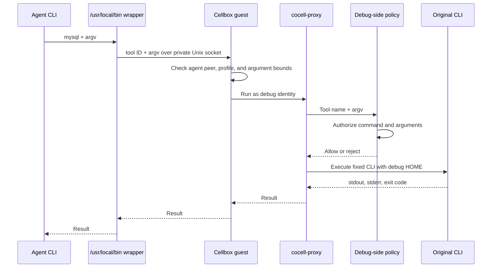

# Cellbox design in CoCell

CoCell owns projects, sessions, and the binding between a project and its Sandbox. Cellbox owns the Sandbox image, guest process, protected tool execution, and Kubernetes runtime. Sessions in one project share a Sandbox workspace while keeping separate conversation threads.

## Components

| Component | Responsibility |
| --- | --- |
| CoCell backend | Keeps project and session state, requests Box operations, and connects to the Codex App Server in the Sandbox. |
| Cellbox API | Authenticates clients, stores Box and operation state, and applies an admitted profile when creating a Box. |
| ResumablePod controller | Creates and monitors the Kubernetes Pod on the selected node; saves and restores same-node gVisor checkpoints. |
| Cellbox guest | Starts the agent workload, serves workspace and execution requests, and runs admitted tools under the separate debug identity. |

CoCell currently selects Cellbox's `resumable-k8s-pod` provider. Cellbox also has a Docker provider; the node and checkpoint behavior below describes the Kubernetes installation.

## Image layers

```text
MyBox user base image
  └─ CoCell box-wrap layer
       └─ Cellbox prepared layer
            └─ immutable registry image used by the Cellbox profile
```

| Layer | Contents and owner |
| --- | --- |
| MyBox | Locally managed base image with user-selected tools such as MySQL, kubectl, and Go. Its `deploy/mybox/` configuration and policy files are ignored by Git. |
| CoCell box-wrap | [Dockerfile](../deploy/box-wrap/Dockerfile) installs the Codex CLI, restic, launcher, archive tools, and proxy code. For each configured proxy, the build copies the original CLI to `/opt/cellbox/debug-bin/<tool>` before placing a same-name wrapper in `/usr/local/bin/`. |
| Cellbox prepared layer | Cellbox's `cellbox-image` command adds the static `/opt/cellbox/bin/cellbox-guest` binary. The guest creates and checks the agent and debug identities when the container starts. |

[The image builder](../deploy/scripts/cellbox/build-cocell-image.sh) composes these layers. Cellbox computes an image key from the resolved base image ID, platform, guest binary, and optional product payload. Deployment publishes the prepared image and places its immutable registry digest in the Cellbox profile. Credentials are supplied at runtime; they are absent from the image layers.

## Sandbox runtime and workspace

The Cellbox profile fixes the image, guest configuration, admitted tools, namespace, and node. The current `resumable-k8s-pod` provider creates a ResumablePod on that node. The agent runs in `/home/agent/workspace`; a separate debug identity executes protected tools. The debug home can be supplied by a private host mount whose ownership matches that identity. The agent cannot read that home.

Idle suspension uses a gVisor checkpoint on the same node. The current workspace is part of the Sandbox filesystem, so changing a profile image affects newly created Sandboxes. To move an active project to a new image, the operator takes a workspace backup and uses project rebuild. CoCell creates a candidate Sandbox from the new profile, restores and verifies the OSS archive, then switches the project binding and cleans up the old Sandbox. The `refresh-runtime` operation still requires the same image.

The current ResumablePod, checkpoint, and debug host mount are node-bound. A future disposable-Pod design would need storage for the workspace and debug credentials that is accessible from another node, plus a lifecycle that recreates the Pod from the selected image. Cross-node scheduling is not implemented by the current provider.

## Protected tool proxy



The image-baked wrapper calls [tool-client.mjs](../deploy/box-wrap/tool-client.mjs). It accepts only tool IDs in the image-baked allowlist and forwards the original argument array to `cellbox-guest tool`. The guest's Unix socket checks the caller's agent identity. Its profile binds each tool ID to a fixed executable and fixed leading arguments. The policy must reject CLI flags that could redirect credential loading or exceed the tool's authorized operations.

CoCell proxy tools use `passThroughArgs: true`. Cellbox accepts up to 32 caller arguments and 8192 UTF-8 bytes in total, rejects NUL bytes, and passes the array to [cocell-proxy](../deploy/box-wrap/tools/cocell-proxy). That process runs as the debug identity, invokes the configured policy, and then runs `/opt/cellbox/debug-bin/<tool>` with the same arguments. The policy decides which commands are allowed; pass-through controls argument transport, not authorization. Other protected tools can still use `inputPatterns` and `credentialEnv`, including CoCell's archive tools.

Native CLIs read their credential files from the private debug home, for example a MySQL login-path file or kubeconfig. The proxy configuration does not need `credential_env` for those CLIs. A missing file remains a credential setup problem even when the wrapper and proxy work.

## Adding or updating a proxy tool

1. Install the CLI in the local MyBox base image. Define its ID and policy in ignored `deploy/mybox/sandbox.toml`; put the policy executable under ignored `deploy/mybox/proxy-tools/`.
2. Build the Sandbox image with the matching `COCELL_USER_BASE_IMAGE`. [prepare-proxy-tools.py](../deploy/scripts/cellbox/prepare-proxy-tools.py) generates the wrapper, image allowlist, and copied policy; [proxy_tools.py](../deploy/scripts/cellbox/proxy_tools.py) generates the admitted Cellbox profile entry.
3. Publish a new immutable Sandbox image and update the profile. Existing Sandboxes keep their original image. Upgrade an active project through a verified workspace archive and restore.

The tool set is selected at image build time. A writable runtime tool directory or live tool registration is not part of this design.
