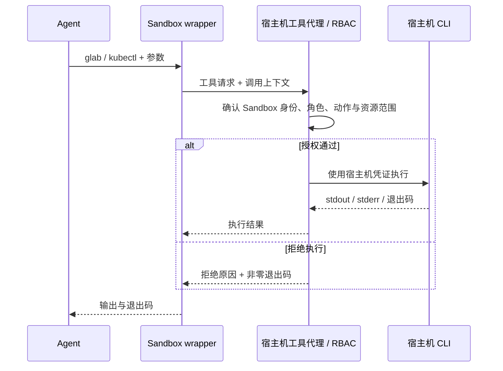

# 工具挂载

本文描述工具挂载的设计：Sandbox 提供 `glab`、`kubectl` 等命令的 wrapper（wrap），Agent 按普通 CLI 的方式调用；wrapper 将请求交给 RBAC 执行入口，授权通过后，由宿主机使用本机 CLI 和凭证执行，再将结果返回 Agent。工具与权限统一配置，方便为不同 Sandbox 按需添加能力。

## 调用链

Sandbox 中的同名 wrapper 放入命令搜索路径，保留 Agent 熟悉的调用方式，例如 `glab mr view 123 --repo example/app` 或 `kubectl get pods -n dev`。wrapper 负责转发；可信的宿主机工具代理负责最终权限校验和执行，角色由服务端绑定到 Sandbox，不接受调用方自行声明角色来获得权限。

## 工具与角色

工具注册与角色授权分别管理：注册工具定义“如何执行”，Sandbox role 定义“允许执行什么”。挂载一个命令入口不自动授予该工具的全部权限。

| 配置 | 内容 |
| --- | --- |
| 工具注册 | 工具名称、宿主机可执行文件、凭证配置、参数解析与动作识别规则 |
| Sandbox 工具挂载 | 当前环境暴露哪些 wrapper，以及对应的工具标识 |
| Sandbox role | 允许的工具、动作、资源范围和需要人工确认的条件 |
| 执行上下文 | 项目、会话、仓库、集群与 namespace 等目标信息 |

例如，同样挂载 `kubectl`，只读角色可以查询指定 namespace 的 Pod 和日志，运维角色可以额外执行获准的变更；挂载 `glab` 的研发角色可以查看和创建指定仓库的 MR，合并权限单独配置。角色定义与人工确认流程见 [RBAC](rbac.md)。

代理根据完整参数解析实际操作与目标，包括显式指定的仓库、集群和 namespace。`glab api`、`kubectl exec` 等入口需要各自的动作规则；无法识别或超出授权范围的调用直接拒绝。需要人工确认的请求，在确认后重新检查权限，并仅执行获批的具体请求。

## 宿主机执行约定

- **CLI 与凭证留在宿主机**：代理为每个工具选择配置好的可执行文件和凭证配置。Sandbox 接收执行结果，无需挂载这些工具的宿主机凭证文件。
- **结构化传参**：请求包含工具标识、参数数组、必要的标准输入和调用上下文。代理按参数数组启动 CLI，不将请求拼成任意宿主机 shell 命令，也不接受任意可执行文件路径或环境变量覆盖。
- **明确文件与目录映射**：Sandbox 工作目录不能直接当作宿主机路径使用。依赖本地仓库、`--filename` 或输出文件的命令，通过工具适配器声明工作区映射或文件传输规则；凭证路径等宿主机配置由代理选择。
- **保留命令体验**：返回标准输出、标准错误和退出码，支持长命令的流式输出、超时与取消。交互式命令需由适配器声明支持方式；默认使用非交互模式。
- **记录调用来源**：记录项目、会话、Sandbox、工具、动作、目标与授权结果。日志避免保存凭证和敏感参数原文。

## 添加工具和权限

1. 在宿主机安装 CLI，配置需要使用的连接与凭证。
2. 注册工具的执行方式、动作与资源解析规则；如需访问项目文件，同时定义目录映射或文件传输方式。
3. 为目标 Sandbox 启用同名 wrapper，并在对应 role 中配置允许的操作和资源范围。
4. 验证一个允许的调用和一个拒绝的调用，检查输出、退出码及调用记录。

新工具复用同一套转发、身份识别、RBAC 和结果返回机制，只补充工具自身的适配与授权规则。调整已有工具的权限时修改角色配置，后续调用使用最新授权；Sandbox 暂停恢复或归档恢复后，工具入口重新连接代理并使用当前角色配置。

## 与现有连接配置的关系

当前连接配置通过导入和 `sandbox.toml` 挂载供 Sandbox 使用，见 [RBAC 的当前连接配置](rbac.md#当前连接配置)。本设计将受管工具的 CLI 与凭证使用收敛到宿主机工具代理；接入代理的工具改用 wrapper，迁移时同时移除该工具在 Sandbox 内的直接凭证挂载。普通构建、测试等本地命令继续在 Sandbox 内执行。
